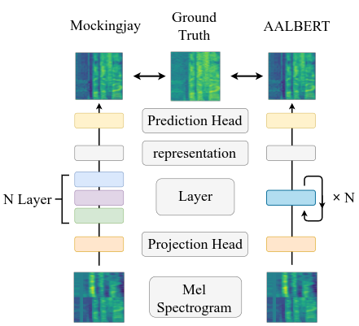
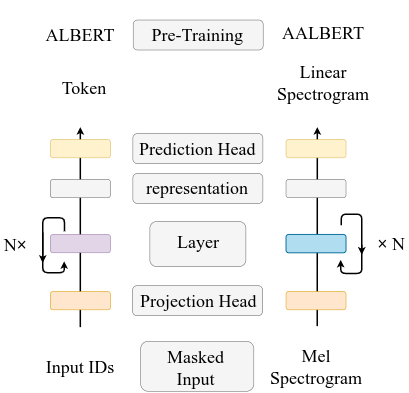

# AALBERT
Here is also the official repository of AALBERT, which is Pytorch lightning reimplementation of the paper, [Audio ALBERT: A Lite Bert for Self-Supervised Learning of Audio Representation](https://ieeexplore.ieee.org/document/9383575). The original code is in [AlbertNew branch](https://github.com/s3prl/s3prl/tree/AlbertNew) of [s3prl](https://github.com/s3prl/s3prl) repo. In the paper, we proposed Audio ALBERT, which achieves performance comparable with massive pre-trained networks in the downstream tasks while having 91% fewer parameters.

<div style="text-align:center"></div>

## Dependencies

- Python 3.8
- Computing power (high-end GPU) and memory space (both RAM/GPU's RAM) is **extremely important** if you'd like to train your own model.
- Required packages and their use are listed [requirements.txt](requirements.txt).
- `pip install -r requirements.txt`

## Pretrain Stage

We use LibriSpeech as our pretraining stage dataset.
You can download dataset by this [link](https://www.openslr.org/12).

- Stage 1: modify dataset path to your local dataset path:
    - AALBERT: 
       config path: `upstream/aalbert/pretrain_config.yaml`
        ```YAML
            line 16: datarc:
                    {Your dataset key name}: {your local dataset path}
        ```
    - Mockingjay:
        `upstream/mockingjay/pretrain_config.yaml`
        ```YAML
            line 16: datarc:
                    {Your dataset key name}: {your local dataset path}
        ```
- Stage 2: run pretraining script

    `python run_pretrain.py -n aalbert_pretrained -u aalbert`
    
    - `-n` : experiment_name
    - `-u` : upstream model: {two option: aalbert / mockingjay}
    - model will save on `result` folder after finish pretraining stage.

## Downstream Stage

Here, we take voxceleb1 speaker classification as our downstream task. You can download dataset from their official [website](https://www.robots.ox.ac.uk/~vgg/data/voxceleb/vox1.html).

After pretraining, We can extract the pretrained model feature on different downstream tasks.

- Stage 1: modify dataset path to your local dataset path
    - voxceleb1_speaker:
        config path: `downstream/voxceleb1_speaker/train_config.yaml`
    ```YAML
    line  9: datarc:
    line 10:    file_path: {your dataset folder path}
    line 11:    meta_path: {your label file path}
    ```
- Stage 2: run downstream script
    - voxceleb1_speaker: 
        ```bash
        python run_downstram.py \
        -c downstream/voxceleb1_speaker/train_config.yaml \
        -g result/pretrain/{your_pretrained_model_folder}/model_config.yaml  \
        -t result/pretrain/{your_pretrained_model_folder}/pretrained_config.yaml \
        -u aalbert \
        -d voxceleb1_speaker \
        -k result/pretrained/{your pretrained_model_folder}/checkpoints/{checkpoint_you_want_to_use.ckpt} \
        -n voxceleb1_result
        ```
    - `-n`: experiment name
    - `-c`: downstream training config
    - `-g`: pretrained model config
    - `-t`: load pretrained model pretrained config
    - `-u`: upstream model: {two option: aalbert / mockingjay}
    - `-d`: downstream task name
    - `-k`: model checkpoint path
    - `-f`: finetune pretrained model or not, default=False


